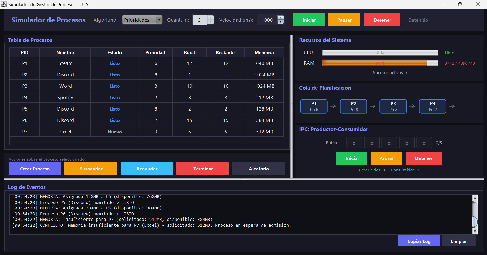
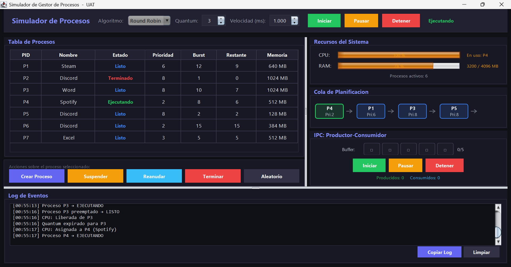
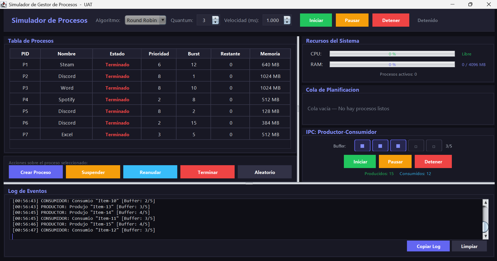

# Simulador de Gestor de Procesos

 

## Descripción
Este proyecto es un simulador desarrollado para la asignatura de Sistemas Operativos que emula la gestión de la memoria RAM, los algoritmos de planificación de la CPU y la sincronización de hilos.

## Características y Evidencias

* **Gestión de Memoria Estricta (4096 MB).**

* **Algoritmos de Planificación (FCFS, SJF, Prioridades, Round Robin con preemption).**

* **Sincronización IPC (Productor-Consumidor con semáforos).**

## Estructura del Proyecto

* `src/`: Contiene el código fuente del simulador en Java.
* `out/`: Carpeta donde se generan los binarios (.class) compilados.
* `capturas/`: Directorio que contiene las imágenes de evidencia del funcionamiento del simulador.

## Ejecución

Para compilar y ejecutar el simulador, simplemente utiliza el archivo por lotes incluido en la raíz del proyecto:
`compilar_y_ejecutar.bat`

## Créditos

* **Autor:** Jose Manuel Garcia Vega, Juan Antonio Casanova Torres, Victor Jhonatan Montoya Luna
* **Universidad:** Universidad Autónoma de Tamaulipas (UAT)
* **Materia:** Sistemas Operativos
* **Docente:** Dante Adolfo Muñoz Quintero
